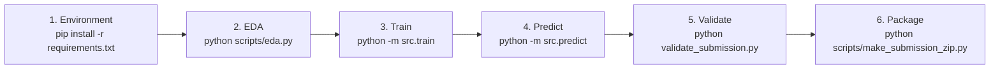

# Business Entity Resolution — Code Execution Guide

This document describes how to execute and reproduce the Business Entity Resolution solution from the `code/business_entity_resolution/` directory.

---

## 1. Execution Order

To reproduce the solution, run the scripts in the following order:



| Order | Script / Command | Purpose | Input Files | Output Files |
| :---: | :--- | :--- | :--- | :--- |
| **1** | `pip install -r requirements.txt` | Install all dependencies | `requirements.txt` | Installed Python packages |
| **2** | `python scripts/eda.py` | Inspect data shapes, countries & singletons | `data/dataset/train/`, `data/dataset/test/` | Terminal statistics |
| **3** | `python -m src.train --config configs/config.yaml` | Run candidate generation, feature extraction, 5-fold OOF models & threshold search | `data/dataset/train/` | `models/lgbm_final.pkl`<br/>`models/xgb_final.pkl`<br/>`models/meta.pkl`<br/>`models/threshold.txt` |
| **4** | `python -m src.predict --config configs/config.yaml` | Generate test candidates, compute features, score pairs & apply threshold | `data/dataset/test/`, `models/` | `../../output/candidate_pairs.tsv`<br/>`../../output/matching_results.tsv` |
| **5** | `python ../../data/utils/validate_submission.py --matching ../../output/matching_results.tsv --candidate ../../output/candidate_pairs.tsv --test-dir ../../data/dataset/test` | Validate submission format compliance | `../../output/*.tsv`, `data/dataset/test/` | Verification PASS/FAIL |
| **6** | `python scripts/make_submission_zip.py` | Create submission `.zip` excluding raw datasets | `code/`, `output/`, `models/` | `../../submission.zip` |

---

## 2. Quick One-Line Execution

To run steps 3, 4, and 5 sequentially with a single command:

```bash
# Run from code/business_entity_resolution/
python scripts/run_pipeline.py
```

Optional flags:
- `--skip-train`: Skip training and run prediction directly using pre-trained weights in `models/`.
- `--config path/to/config.yaml`: Use a custom configuration file.

---

## 3. Individual Stage Details

### Step 1: Environment Setup
```bash
cd code/business_entity_resolution
pip install -r requirements.txt
```

### Step 2: Exploratory Data Analysis
```bash
python scripts/eda.py
```
Checks:
- Row counts across Source 1, 2, 3 in train and test splits
- Country distribution (verifying the presence of France in test)
- Match count distribution and singleton percentage (5.6%)

### Step 3: Model Training
```bash
python -m src.train --config configs/config.yaml
```
- Performs country-partitioned TF-IDF candidate generation (names + addresses).
- Generates 26 pairwise similarity and graph-level features.
- Trains 5-fold Out-Of-Fold LightGBM and GPU-accelerated XGBoost.
- Stacks predictions into a calibrated Logistic Regression meta-learner.
- Performs a 2D grid search over decision threshold and margin-based abstention gap to maximize $F_{0.5}$.
- Retrains final base models and exports all artifacts to `models/`.

### Step 4: Test Prediction
```bash
python -m src.predict --config configs/config.yaml
```
- Generates test candidate pairs partitioned by country (India, US, France).
- Saves `output/candidate_pairs.tsv`.
- Scores candidate pairs using the trained ensemble.
- Applies optimal threshold $t^*$ and margin gap $g^*$.
- Saves final predictions to `output/matching_results.tsv`.

### Step 5: Submission Validation
```bash
python ../../data/utils/validate_submission.py \
    --matching  ../../output/matching_results.tsv \
    --candidate ../../output/candidate_pairs.tsv \
    --test-dir  ../../data/dataset/test
```

### Step 6: Create Submission Archive
```bash
python scripts/make_submission_zip.py
```

---

## 4. Hardware Acceleration (GPU / CPU)

- **Automatic Device Resolution**: Configured via `system.device: "auto"` in `configs/config.yaml`.
- **GPU (CUDA)**:
  - XGBoost automatically runs on CUDA (`tree_method='hist'`, `device='cuda'`).
  - SentenceTransformers uses CUDA if embeddings are enabled.
- **Fail-Safe Fallback**:
  - `safe_fit` and `safe_predict_proba` catch CUDA out-of-memory or driver errors and automatically switch to multi-core CPU (`n_jobs=-1`) without interrupting the pipeline.

---

## 5. File Structure Reference

| File / Folder | Role |
| :--- | :--- |
| `configs/config.yaml` | Central configuration file for blocking, models, stacking, and device options. |
| `scripts/eda.py` | Fast dataset summary and distribution analysis. |
| `scripts/run_pipeline.py` | Complete end-to-end execution runner. |
| `scripts/make_submission_zip.py` | Clean submission archive creator. |
| `src/preprocess.py` | Legal suffix normalization, phonetics (Soundex/Metaphone), digit parsing. |
| `src/blocking.py` | Country-partitioned multi-pass candidate generation (Name + Address TF-IDF). |
| `src/features.py` | 26 pairwise string, phonetic, numeric, margin, and degree features. |
| `src/models.py` | Model architectures (LightGBM, GPU XGBoost, Calibrated Meta-Learner, safe execution). |
| `src/evaluate.py` | Competition $F_{0.5}$ metric computation and singleton scoring. |
| `src/threshold.py` | 2D grid search over threshold and margin abstention gap. |
| `src/train.py` | End-to-end training, validation, and artifact export script. |
| `src/predict.py` | End-to-end test inference and TSV output generation script. |
| `models/` | Output directory where trained model checkpoints and threshold parameters are saved. |
